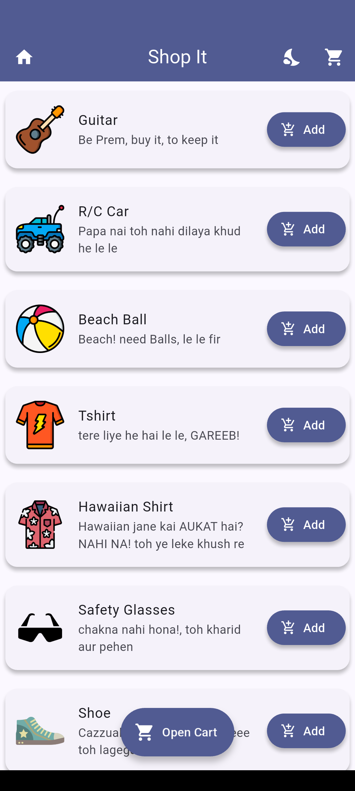
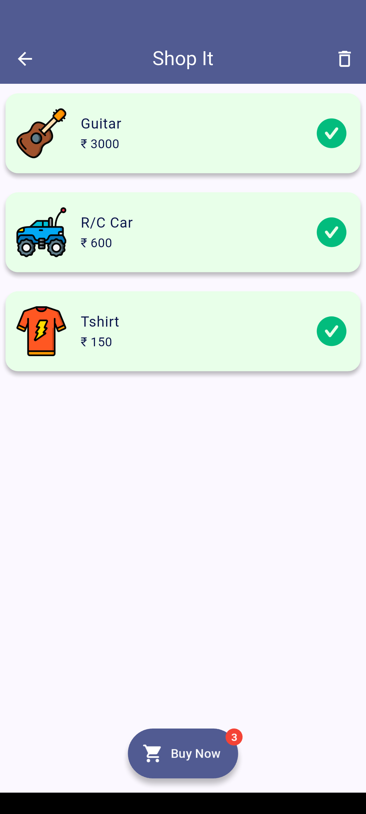
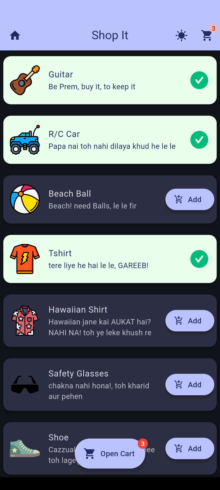

# 🛒 ShopIT – Flutter Shopping Application

ShopIT is a Flutter-based shopping application that demonstrates the core workflow of an e-commerce app. It allows users to add products, store cart data locally, and switch seamlessly between light and dark themes using Provider-based state management.

This project is built to practice Flutter architecture, local storage, and UI design.

---

## ✨ Features

- 🛍️ Add and view products
- 🛒 Shopping cart with persistent storage
- 💾 Cart data saved using SharedPreferences
- 🌗 Light & Dark theme support
- 💱 Currency formatting using Intl
- 🔄 State management with Provider
- 🎨 Clean and modern Material UI

---

## 🛠️ Built With

- **Flutter**
- **Dart**
- **Provider** – State management
- **shared_preferences** – Local cart storage
- **intl** – Currency formatting
- **Material Design**

---

## 📂 Project Structure
```plaintext
lib/
├── main.dart
├── custom_ui/
│ └── product_card.dart
├── data/
│ └── product.dart
├── model/
│ └── product.dart
├── provider/
│ └── data_provider.dart
├── screens/
│ ├── add_product_screen.dart
│ └── shopping_cart_screen.dart
├── theme/
│ └── theme.dart

```


---

## 📸 App Screenshots

| Home Screen | Cart Screen |
|------------|-------------|
|  |  |

| Light Mode | Dark Mode |
|-----------|-----------|
|  |  |

---

## 🚀 Getting Started

### Prerequisites

- Flutter SDK installed
- Android Studio or VS Code
- Emulator or physical device

### Run the App

```bash
flutter pub get
flutter run
